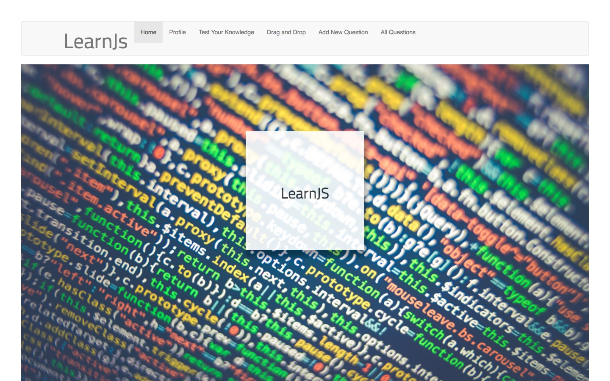
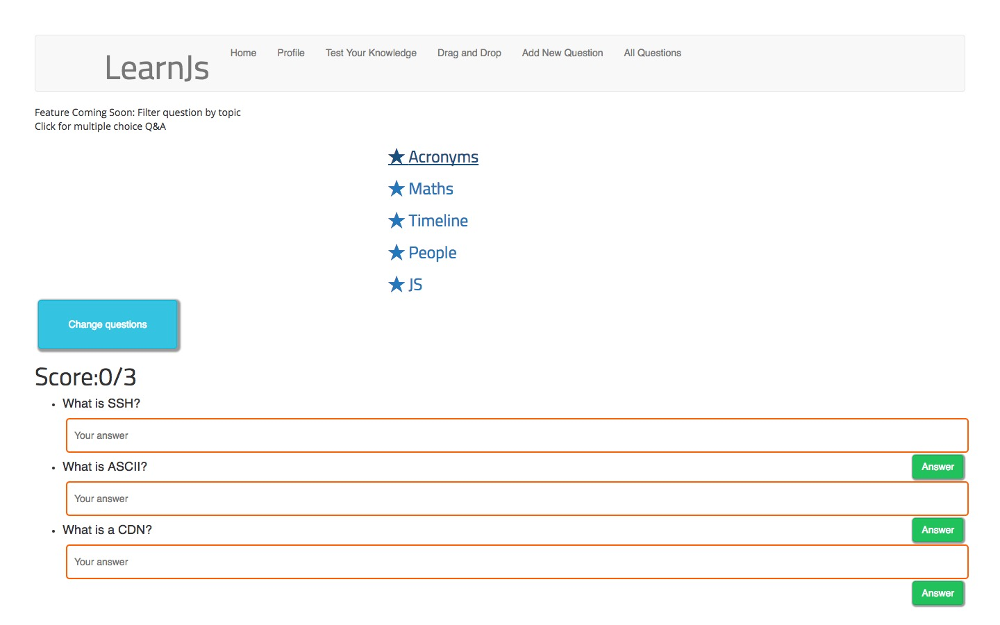
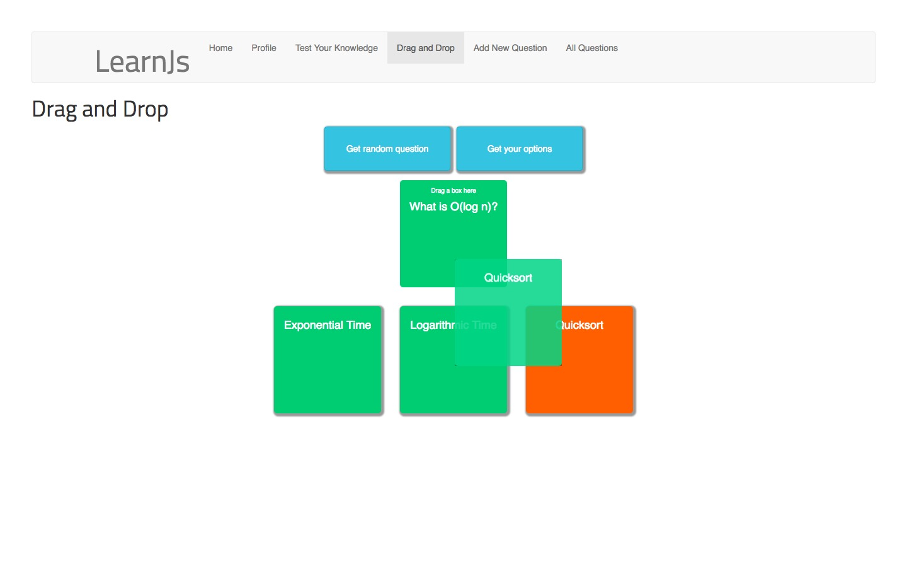
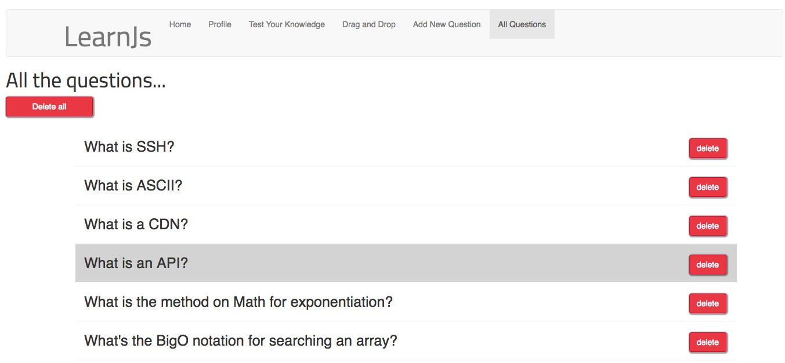

# learnJS
> MERN App using React Router (in progress):
>A full-stack app design to help someone learn JavaScript and general CS concepts.


****

****

****



## Installing / Getting started

To install make sure you have mongoDB running ("mongod", "mongo") first. 

```
"npm run start" on the main directory to seed the database
"npm start" on the client. 

```

The app runs on localhost:3000 and should launch on the welcome page visible above
###
User can:
* add new questions to the database
* delete questions 
* take a quiz - with a pop-up dog gif for full marks!
* do a drag-and-drop multiple-choice test

### Progress
This is an ongoing project, started in the final week of a coding bootcamp.
Further features will include user log-in functionality; full CRUD functionality; improved UI.

## Developing

### Built With
Create-React-App, Express/Node.js, MongoDB,  React Router v4, React DnD, React Bootstrap, React Router Bootstrap

### Prerequisites
Dependencies: body-parser; immutability-helper; prop-types; react-dnd-html-backend

## Api Reference

API used for dog Gifs: https://dog.ceo/ - no API key needed

## Database

Simple one-collection database in MongoDB


